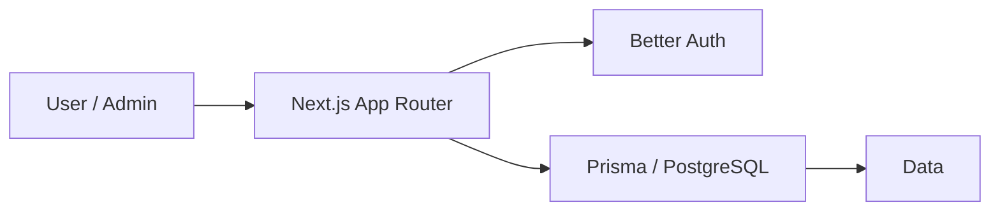

## Project Architecture overview

The app uses the Next.js App Router with server components, route handlers, and a shared data layer. The main architectural flow is:

1. The browser requests pages from the Next.js app router.
2. Server components and route handlers fetch data from Prisma/PostgreSQL.
3. Authentication is handled through Better Auth with email OTP and social login support.
4. Admin-only actions are protected by server-side authorization checks.

## Tech stack

- Frontend: Next.js 16, React 19, TypeScript
- Styling: Tailwind CSS, shadcn/ui
- Authentication: Better Auth with email OTP and Google social login
- Data layer: Prisma ORM with PostgreSQL
- Security and protection: Arcjet rate limiting and server-side authorization
- Email: Resend
